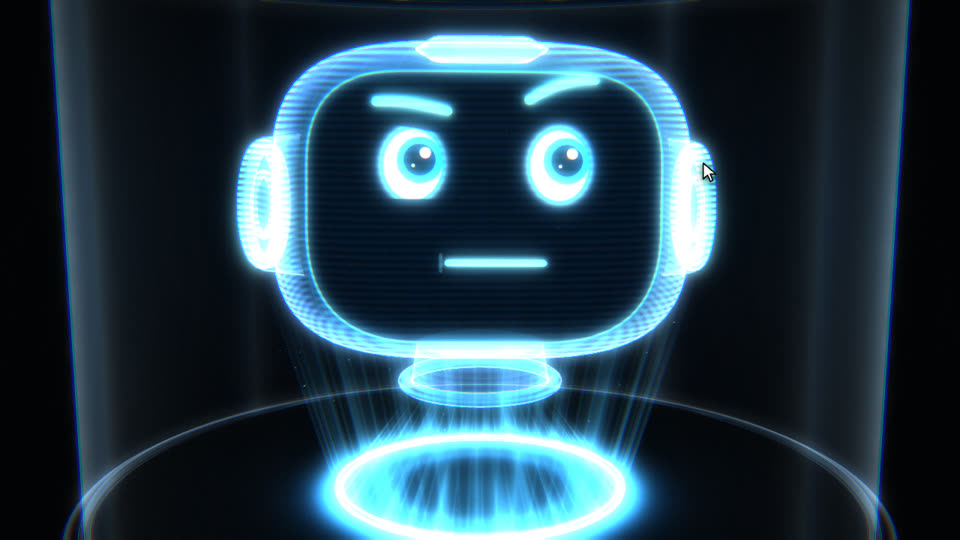
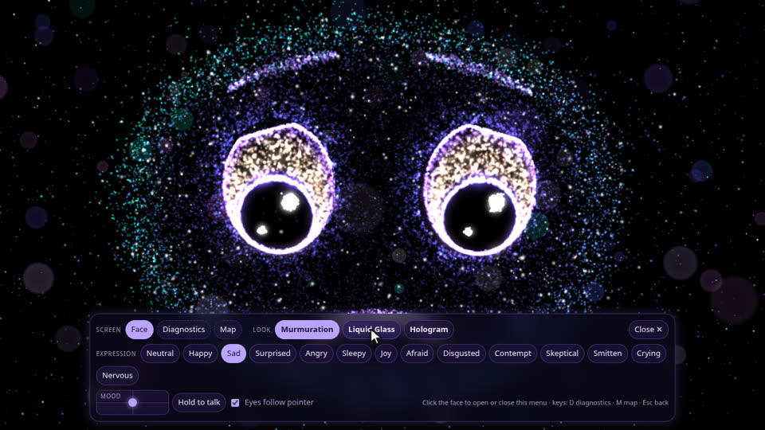
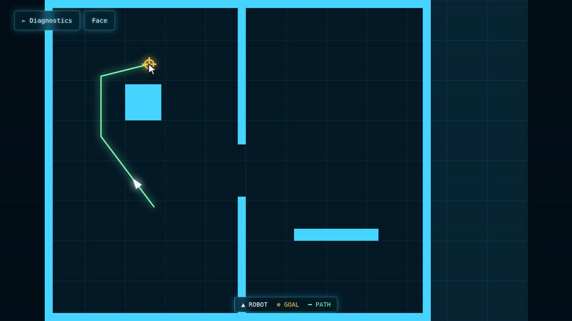
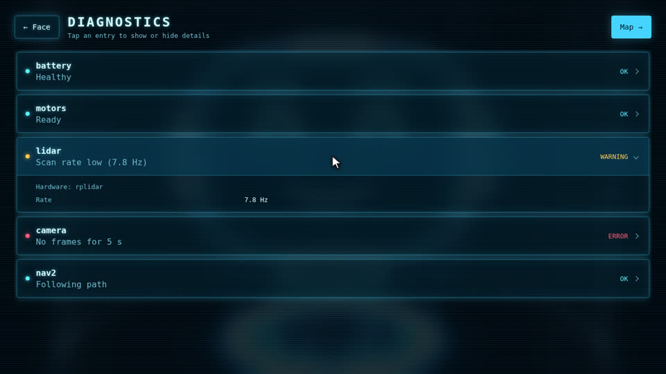

# Robot Face [](https://github.com/frankjoshua/docker-ros2-face/actions) [](https://hub.docker.com/r/frankjoshua/ros2-face)

An animated face for the screen on your robot, driven by ROS 2 topics. One node serves a web page
to any kiosk browser: the face reacts to expressions, gaze and speech, and the same page shows the
robot's diagnostics and its navigation map, where a tap sends a goal.

<p align="center">
  <a href="docs/media/demo.mp4"></a>
  <br><sub><a href="docs/media/demo.mp4">Watch the 36-second demo in full quality (MP4)</a></sub>
</p>

## Three looks, one face

Pick a look from the on-screen menu or with `/face/look`. All three are driven by the same expression
rig, so every expression, gaze and mouth movement works in each one.

| Murmuration | Liquid glass | Hologram |
|:---:|:---:|:---:|
|  |  |  |
| ~40k particles that re-flock on every change | Refractive, wobbly glass with squash and stretch | A 3D head that turns toward the gaze target |

## Diagnostics and map

Click or tap the face to open the menu, then choose **Diagnostics** or **Map**. Both screens follow
the selected look's colours and fonts.

| Menu | Map | Diagnostics |
|:---:|:---:|:---:|
|  |  |  |
| Screens, looks, 14 expressions, mood pad, talk | `/map`, robot pose from TF, path and goal; tap to send a goal | `/diagnostics` by component; tap for details |

## Quick start

```sh
docker run -it --network=host --ipc=host --pid=host frankjoshua/ros2-face
```

Open `http://<robot>:8080/` in any browser with WebGL 2. On the robot itself, run it as a kiosk:
`chromium --kiosk http://localhost:8080/`. Then try it from another terminal on the same network:

```sh
ros2 topic pub -1 /face/expression std_msgs/String "{data: happy}"
ros2 topic pub -1 /face/gaze geometry_msgs/Point "{x: 0.8, y: 0.2}"
ros2 topic pub -r 20 /face/mouth std_msgs/Float32 "{data: 0.7}"
ros2 topic pub -1 /face/look std_msgs/String "{data: hologram}"
```

No robot handy? Preview the page with sample data and no ROS at all:

```sh
python3 -m http.server -d src/robot_face/robot_face/web 8000
# open http://localhost:8000/?demo     (?demo=looks also cycles the looks)
```

## Using the screen

- **The face is the home screen.** Click or tap it to open the menu; click it again, press
  **Close** or Escape to hide it (it also hides after 8 s).
- **Menu:** **Face / Diagnostics / Map**, the three looks, all 14 expressions, a mood pad (drag
  for pleasant/unpleasant × calm/excited) and **Hold to talk**.
- **Getting back:** Diagnostics has **← Face** and **Map →**; the map has **← Diagnostics** and
  **Face**; Escape steps back one screen. Keys: **D** diagnostics, **M** map.
- The eyes follow the mouse. 2.5 s after it stops, the gaze returns to `/face/gaze`.
- Clicks act like one more publisher: the newest input wins, so a ROS message replaces what was
  clicked and vice versa.
- `?controls=off` removes the menu for a locked-down kiosk; tapping the face then opens diagnostics.
  `?look=hologram` picks the starting look.

## ROS interface

**Face (in):**

| Topic              | Type                     | Meaning |
|--------------------|--------------------------|---------|
| `/face/expression` | `std_msgs/String`        | Preset: `neutral`, `happy`, `sad`, `surprised`, `angry`, `sleepy`, `joy`, `afraid`, `disgusted`, `contempt`, `skeptical`, `smitten`, `crying`, `nervous`. Unknown values are ignored. |
| `/face/affect`     | `geometry_msgs/Point`    | Mood as `x` = valence, `y` = arousal, each -1..1; blends the nearest presets. `z` ignored. |
| `/face/channels`   | `sensor_msgs/JointState` | Direct control of face parts (see below): `name[]` channels, `position[]` values 0..1. Holds until the next message; an empty message clears it. |
| `/face/gaze`       | `geometry_msgs/Point`    | Look target. `x`, `y` in -1..1, (0,0) = straight ahead, +x right, +y up. `z` ignored. |
| `/face/mouth`      | `std_msgs/Float32`       | Mouth opening 0..1. Publish at audio RMS rate (~20–30 Hz). Closes if no sample for 300 ms. |
| `/face/look`       | `std_msgs/String`        | `murmuration`, `liquid_glass` or `hologram`. |

**Robot data (in) and goals (out):**

| Topic                      | Type                            | Meaning |
|----------------------------|---------------------------------|---------|
| `/diagnostics`             | `diagnostic_msgs/DiagnosticArray` | Shown on the Diagnostics screen, merged by component name. |
| `/map`                     | `nav_msgs/OccupancyGrid`        | Shown on the Map screen (transient-local QoS, so a latched map arrives). |
| TF `map_frame → base_frame` | —                              | Robot pose on the map, polled at 5 Hz. |
| `path_topic` (`plan`)      | `nav_msgs/Path`                 | Planned path; an empty path clears the line. |
| `goal_topic` (`goal_pose`) | `geometry_msgs/PoseStamped`     | Shown as the goal; **published** when someone taps the map, with the heading pointing from the robot toward the tap. |

Goals and paths in other frames are transformed into `map_frame` with TF. The map assumes a
zero-yaw origin, keeps the latest goal and path, and doesn't track whether navigation finished.

**Parameters:** `port` (8080), `map_frame` (`map`), `base_frame` (`base_link`), `goal_topic`
(`goal_pose`), `path_topic` (`plan`). Example:
`ros2 run robot_face face_node --ros-args -p path_topic:=/my/planner/path`.

More examples:

```sh
ros2 topic pub -1 /face/affect geometry_msgs/Point "{x: -0.6, y: -0.5}"
ros2 topic pub -1 /face/channels sensor_msgs/JointState "{name: [browOuterUpLeft, tears], position: [1.0, 0.8]}"
ros2 topic pub -1 /face/channels sensor_msgs/JointState "{}"
```

## How expressions work

Expressions are defined once in
[`web/face/vocabulary.json`](src/robot_face/robot_face/web/face/vocabulary.json) as recipes over
**channels**: the 52 ARKit blend-shape names (`browInnerUp`, `mouthSmileLeft`, `eyeBlinkRight`, …)
plus seven cartoon effects (`pupilDilate`, `blush`, `tears`, `sweat`, `sparkle`, `squash`,
`stretch`), each 0..1. ARKit's `Left`/`Right` are the face's own sides, so `Left` is on the viewer's
right. A side-less name such as `mouthSmile` sets both sides. Each frame the browser stacks:

1. **Base:** the last `/face/expression` preset or `/face/affect` blend, whichever arrived last.
2. **Override:** `/face/channels` values replace the base for the channels they name.
3. **Automatic:** gaze (with small eye flicks), speech from `/face/mouth`, and blinks (skipped while
   the eyes are already mostly shut).

Changes ease in and out over ~0.3 s. Every look draws the result through one shared geometry
([`pose.js`](src/robot_face/robot_face/web/face/pose.js)), so adding an expression is one new recipe,
not new art for each look. Timing constants are at the top of
[`web/face/rig.js`](src/robot_face/robot_face/web/face/rig.js); quality constants (particle count,
texture size, pixel-ratio cap) are at the top of each file in `web/face/looks/`.

## Develop

1. Install Docker, VS Code and the **Dev Containers** extension.
2. Open this folder in VS Code, then `Ctrl+Shift+P` → **Dev Containers: Reopen in Container**.
3. In a terminal (ROS is already sourced):
   ```sh
   colcon build --symlink-install
   source install/setup.bash
   ros2 run robot_face face_node
   ```
   and open `http://localhost:8080/` (the container uses host networking).

The repo root is the colcon workspace (`/home/ws` in the container). The container runs as the
non-root `ubuntu` user, already in the `dialout`/`video`/`plugdev` groups, and includes Claude Code.
Without VS Code, any devcontainer tool works:
`devcontainer up --workspace-folder .` then `devcontainer exec --workspace-folder . bash`. Keep the
repo mounted at `/home/ws`.

> **Claude settings:** the dev container bind-mounts your host `~/.claude` and `~/.claude.json`.
> Run `claude` once on the host first so Docker doesn't create them root-owned. Hook errors about
> host-only paths are harmless; remove the two mounts from `devcontainer.json` for full isolation.

**Layout.** One `Dockerfile`, three stages from the same base image (`BASE_IMAGE`, default
`frankjoshua/ros2:humble`; change it to target another ROS 2 distro):

- `base`: shared dependencies. Add apt/pip packages here so dev and prod can't drift.
- `dev`: `base` plus the `ubuntu` user and a shell; this is what the dev container opens.
- `prod`: `base` plus `src/` built with colcon; runs the face node. This is what gets published.

```
src/robot_face/robot_face/
├── face_node.py      # ROS node + HTTP/SSE server
└── web/              # the page: index.html, face/ (rig, looks, views, menu), vendor/three.js
```

### Tests

```sh
colcon test --packages-select robot_face --event-handlers console_direct+
```

The Python/HTTP tests run without ROS. To include the browser tests (Playwright + Chromium):

```sh
python3 -m venv .venv && source .venv/bin/activate
python -m pip install -r requirements-test.txt
python -m playwright install chromium
PYTHONPATH=src/robot_face python -m pytest -q src/robot_face/test
```

Set `CHROMIUM_EXECUTABLE=/path/to/chrome` to use an installed browser. Browser tests are skipped
when Playwright isn't installed; CI runs the full suite before building.

## Deploy

`build.sh` builds the `prod` stage for amd64 and arm64 with `docker buildx`:

```sh
./build.sh -t frankjoshua/ros2-face -l   # local single-arch build
./build.sh -t frankjoshua/ros2-face -p   # multi-arch build and push to Docker Hub
```

GitHub Actions ([`ci.yml`](.github/workflows/ci.yml)) runs the tests, then builds and publishes the
image on every push to `main`; pull requests build without publishing. Publishing needs two
repository secrets under **Settings → Secrets and variables → Actions**: `DOCKERHUB_USERNAME` and
`DOCKERHUB_TOKEN` (a Docker Hub access token with read & write access).

Host networking is required because ROS 2 DDS uses ephemeral ports; `--ipc=host` enables
shared-memory transport between containers, and `--pid=host` keeps DDS GUIDs unique.

## Networking and discovery

The dev container joins your LAN out of the box: `--net=host --ipc=host --pid=host`,
`ROS_AUTOMATIC_DISCOVERY_RANGE=SUBNET` (use `LOCALHOST` to stay on this machine) and
`ROS_DOMAIN_ID=0` (give each project or person its own ID on a shared LAN). **`--ipc=host` is
required:** without a shared `/dev/shm`, Fast DDS instances silently fail to connect.

Quick check, in two terminals on the same or different machines:

```sh
ros2 topic pub /chatter std_msgs/msg/String "{data: hello}"   # A
ros2 topic echo /chatter                                       # B
```

**Robot not showing up?** Multicast discovery is reliable on wired LANs but often blocked on Wi-Fi
(ssh still works, yet `ros2 topic list` is empty). Without changing the robot:

1. In [`.devcontainer/fastdds_profiles.xml`](.devcontainer/fastdds_profiles.xml), set the robot's IP
   in `initialPeersList` (currently `192.168.2.50` for `tx2.local`). A VPN address such as Tailscale
   works too and keeps discovery working off the LAN.
2. If the robot runs many nodes, raise `maxInitialPeersRange` (default 64).
3. Restart the face node, then `ros2 daemon stop` before checking `ros2 topic list`. The profile is
   bind-mounted, so no rebuild is needed.

**The daemon will lie to you.** With `--net=host`, every container on the machine shares one
`ros2` daemon, started with whatever discovery config the first shell had. After changing profiles,
peers or `ROS_DOMAIN_ID`, run `ros2 daemon stop`. `ros2 topic list --no-daemon` bypasses it: if
that shows the robot and the plain command doesn't, a stale daemon is answering. Alternatively run
a Fast DDS Discovery Server and set `ROS_DISCOVERY_SERVER=<host-ip>:11811`.

## Credits

Built from [docker-ros2-template](https://github.com/frankjoshua/docker-ros2-template). Uses
[three.js](https://threejs.org/) r186 (MIT), vendored in `web/vendor/`. Expression channels follow
Apple's ARKit blend-shape names, which map onto the Facial Action Coding System (FACS).

**License:** Apache 2.0 · **Author:** Joshua Frank
[@frankjoshua77](https://www.twitter.com/@frankjoshua77) · [roboticsascode.com](http://roboticsascode.com)
