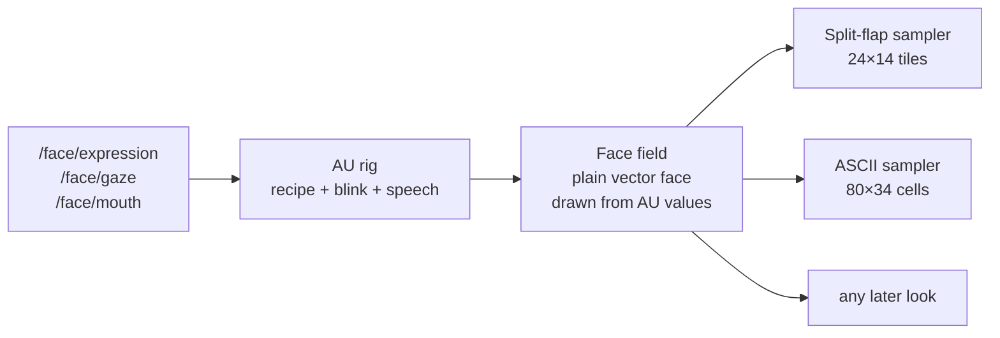

# Split-flap and ASCII faces: design input for the expression work

From the content generator, 2026-10-05. Joshua picked concepts **07 Split flap** and **08 ASCII** from the
concept round (https://artifacts.joshfrank.com/robot-face-concepts/) as good starts. This note explains how
they could work on top of an expression system defined in Action Units (FACS). It is input for the agent
defining expressions here, not a settled spec.

- **Running prototype** (both looks, AU sliders, topic emulator, full-screen `#flap` / `#ascii`):
  https://artifacts.joshfrank.com/robot-face-flap-ascii/. Source: `docs/concepts/prototype/index.html`.
  It is a single file, plain canvas 2D, with no dependencies beyond Google Fonts.
- **Visual targets** (generated with gpt-image-2):
  - [split-flap expressions](https://artifacts.joshfrank.com/robot-face-flap-ascii/img/split-flap-expressions.webp)
  - [ASCII expressions](https://artifacts.joshfrank.com/robot-face-flap-ascii/img/ascii-expressions.webp)
  - [flap alphabet](https://artifacts.joshfrank.com/robot-face-flap-ascii/img/split-flap-alphabet.webp)
  - [ASCII talking](https://artifacts.joshfrank.com/robot-face-flap-ascii/img/ascii-talking.webp)

## The idea: define expressions once, sample them per look

1. **Topics stay as they are.** `/face/expression` picks a named recipe, `/face/gaze` moves the pupils (in place
   of AU61–64), and `/face/mouth` drives speech.
2. **AU rig.** The current AU vector eases toward the recipe over about 200 ms. Blink (AU45 → full AU43 for
   about 160 ms) and speech (`AU25 = max(recipe, 1.5·mouth)`, `AU26 = max(recipe, 0.85·mouth)`) are layered on
   top every frame.
3. **Face field.** A plain vector drawing of the face, made only from AU values. Its colours double as
   labels, so samplers know what they're looking at:

   | Colour | Meaning |
   |---|---|
   | `#ffffff` | eye white |
   | `rgb(255,200,60)` | eye amber, the lower crescent of the eye |
   | `rgb(255,170,0)` | features: brows, lips, lid edges |
   | `rgb(255,110,40)` | mouth inside |
   | black | pupils and background |

   The ASCII sampler also asks for a shaded head with ear pieces.
4. **Samplers.** Each look turns the field into its own grid, so neither look has per-expression art.

### What the face field reads from each AU (prototype geometry)

| AU | Name | What it moves in the field |
|---|---|---|
| 1 | Inner brow raise | Brow inner end up. Upper lid inner corner lifts, so the lid slopes down at the outer side (sad). |
| 2 | Outer brow raise | Brow outer end up |
| 4 | Brow lower | Brow inner end down and pulled to the centre; upper lid inner corner drops (the angry V) |
| 5 | Upper lid raise | Eye taller, pupil smaller, lids retract |
| 6 | Cheek raise | Lower lid arches up into the eye (the happy arch) |
| 7 | Lid tighten | Upper lid down a little, lower lid up a little |
| 43 | Eyes close | Upper lid down; at 1 the eye is closed. AU45 blink drives it too. |
| 12 | Lip corner pull | Mouth corners up, mouth a bit wider |
| 15 | Lip corner depress | Mouth corners down |
| 18 | Lip pucker | Mouth narrower and rounder (the surprised "o") |
| 20 | Lip stretch | Mouth wider (fear) |
| 24 | Lip press | Lips thinner, opening reduced |
| 25 | Lips part | Small opening |
| 26 | Jaw drop | Large opening |

### Recipes used in the prototype (intensity 0–1)

| Expression | Recipe |
|---|---|
| neutral | all 0 |
| happy | AU6 .8, AU12 1, AU25 .25 |
| sad | AU1 .9, AU4 .5, AU15 .8, AU43 .2 |
| surprised | AU1 1, AU2 1, AU5 1, AU25 1, AU26 .6, AU18 .35 |
| angry | AU4 1, AU5 .3, AU7 .8, AU24 .8 |
| afraid (new) | AU1 1, AU2 .6, AU4 .6, AU5 1, AU20 .9, AU25 .6, AU26 .25 |
| sleepy | AU1 .15, AU43 .7, AU25 .1 (not a FACS emotion; mostly held AU43) |

"Afraid" isn't in the current topic list. It's there to show that a new expression is only a new recipe:
both looks rendered it without any new art.

## Split flap (07)

- **Grid:** 24 × 14 tiles on 1024 × 600. Each eye is about 5 tiles wide.
- **Alphabet:** 30 shapes:
  - blank and full;
  - halves;
  - thirds (strips);
  - quarter discs and their concave inverses;
  - half discs on each edge;
  - triangles;
  - a dot and a hole (the pupil);
  - a centre bar.

  Each shape prints in cream (eye) or amber (features).
- **Matching:** the field is drawn at 8 × 8 samples per tile. Each tile's target is the shape with the lowest
  squared error against its patch. The colour is whichever label covers more of the patch.
- **Hysteresis:** a tile retargets only when the new shape beats the current one by more than 1.2 (out of 64).
  Without it the board chatters while the face drifts.
- **Flips:**
  - An ordinary change flips through 0–2 random shapes before landing, with 0–90 ms of per-tile jitter. That
    gives the departures-board cascade.
  - Mouth rows (row 9 and below) flip straight to the target in 50 ms so speech keeps up with 20 Hz;
    other flips take 95 ms.
  - Each flip is drawn as two half-flaps: the top falls and the bottom unfolds.
- **Gaze** is quantised by the tiles, so pupils hop a tile at a time.
- **Sound** (optional): a synthesized clack per landed flip, capped at 5 per frame. It's off by default.
- **Cost:** only flipping or changed tiles are redrawn. Matching is about 0.5 M multiply-adds per frame.

## ASCII (08)

- **Grid:** 80 × 34 cells. The field (plus a shaded head) is drawn at 2 × 2 samples per cell.
- **Characters:** brightness picks from ` .:-=+*#%@`. A strong edge picks `| \ _ /` from the gradient
  direction; eye cells skip this so the pupil reads through the character density.
- **Colour by label:** eye cells use the amber palette; everything else uses phosphor green, graded by
  brightness. A CSS drop-shadow adds the glow.
- **Talking:** mouth-inside cells spell a scrolling line ("HELLO I AM YOUR ROBOT…"). A future `/face/say`
  (`std_msgs/String`) could feed it the real words.
- **Idle life:** topic names drift down empty columns, and about 0.6 % of cells flicker one density step.
- **Rendering:** a glyph atlas (one `drawImage` per cell) at 30 fps. The same sampler would work as a
  post-process over other looks, such as the Murmuration particles.

## What the looks need from the expression definitions

- **Independent parts:** inner and outer brow ends, the upper-lid level plus its slope (inner corner vs outer),
  lower-lid lift, the pupil, left and right mouth corners, and the mouth opening.
- **Strong enough intensities to survive the grid.** At 24 × 14, AU2 or AU7 alone barely changes a tile;
  recipes should push them or pair them.
- **A presentation layer outside FACS** for cartoon extras: blink rate, the ASCII mouth text, sleepy "z",
  and the flap cascade style.

## Open questions

- **Asymmetry:** a wink or a single raised brow means AU values per side (FACS L/R). The prototype is
  symmetric.
- **Direct AU control:** add a `/face/au` topic (unit and intensity, or a full vector) so other nodes can drive
  the rig directly, with `/face/expression` kept as named presets.
- **Blink suppression:** the repo's current page keys it off the class `sleepy`. The prototype keys it off
  AU43 ≥ 0.5, which carries over to any recipe with heavy lids.
- **Robot hardware:** the prototype runs at 60 fps in desktop Chrome. It hasn't been tried on the robot's
  hardware.
